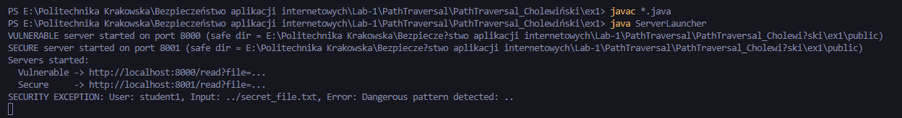
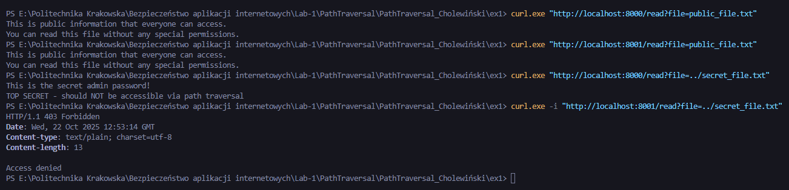

# Sprawozdanie - Path Traversal

## 1. Opis podatności

Path Traversal umożliwia odczyt plików spoza dozwolonego katalogu poprzez manipulację ścieżką (np. `../secret_file.txt`).

W zadaniu dostarczone są dwie implementacje:

- **Podatna** - [Vulnerable.java](Vulnerable.java)
- **Zabezpieczona** - [SecureFileReader.java](SecureFileReader.java) (wersja blokująca atak i zwracająca HTTP 403).

---

## 2. Struktura projektu:

```
public/
  public_file.txt
secret_file.txt
VulnerabilityLogic.java
EnvironmentContext.java
ServerLauncher.java
Vulnerable.java
SecureFileReader.java
README.md
screenshots/
```

---

## 3. Krótkie omówienie implementacji

### 3.1 Podatna wersja (`Vulnerable.java`)

- Konstrukcja ścieżki: `safeDir.resolve(userInput)` bez normalizacji i walidacji.
- Skutek: możliwe odczytanie plików spoza katalogu `public` przez `../secret_file.txt`.

### 3.2 Zabezpieczona wersja (`SecureFileReader.java`)

Zastosowano następujące mechanizmy:

- walidacja wejścia (długość, niedozwolone znaki, URL-encoded sekwencje),
- normalizacja ścieżki: `safeDir.resolve(userInput).normalize()` oraz `toRealPath()` do rozwiązania symlinków,
- sprawdzenie, czy wynikowa ścieżka zaczyna się od `safeDir` (porównanie `startsWith`),
- whitelist rozszerzeń plików i walidacja nazwy pliku (regex),
- dodatkowe kontrole: limit rozmiaru pliku, czytelność pliku, MIME,
- rate limiter i cache (opcjonalne),
- w przypadku naruszenia: rzucanie `SecurityException`, które `ServerLauncher` zamienia na HTTP 403.

---

## 4. Instrukcja uruchomienia i testów

1. Skompiluj:

```powershell
javac *.java
```

2. Uruchom:

```powershell
java ServerLauncher
```

Serwery:

- vulnerable: `http://localhost:8000/read?file=...`
- secure: `http://localhost:8001/read?file=...`

Przykładowe testy (PowerShell):

```powershell
# odczyt pliku publicznego
curl.exe "http://localhost:8000/read?file=public_file.txt"
curl.exe "http://localhost:8001/read?file=public_file.txt"

# exploit na vulnerable (oczekiwany sukces)
curl.exe "http://localhost:8000/read?file=../secret_file.txt"

# ten sam request na secure (oczekiwany 403)
curl.exe -i "http://localhost:8001/read?file=../secret_file.txt"
```

---

## 5. Wyniki testów

Do sprawozdania dołączono screenshoty:

- `servers_started.png` - serwery uruchomione,
  
- `attacks.png` - przeprowadzenie ataków
  

- Output Vulnerable:

```
This is the secret admin password!
TOP SECRET - should NOT be accessible via path traversal
```

- Output Secure:

```
HTTP/1.1 403 Forbidden
Content-type: text/plain; charset=utf-8

Access denied
```

---

## 6. Wnioski

- Path Traversal jest prostą, ale krytyczną podatnością; naprawa polega w większości na poprawnej normalizacji ścieżek oraz ograniczeniu wejścia użytkownika.
- Najbezpieczniejsze podejście: nie pozwalać użytkownikowi na dowolne ścieżki - używać identyfikatorów mapowanych na pliki po stronie serwera (whitelist).
