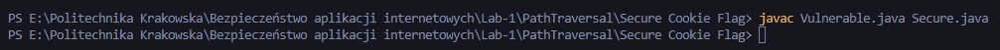
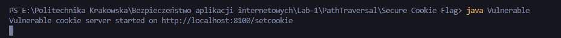
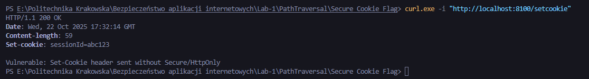
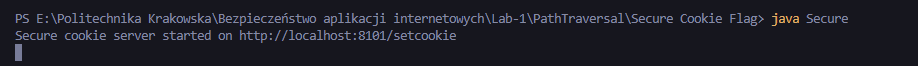
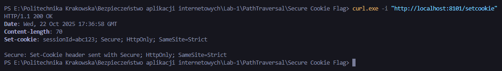
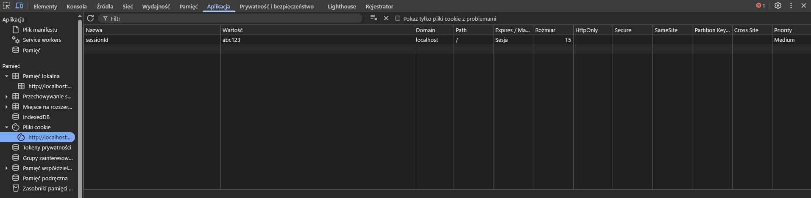
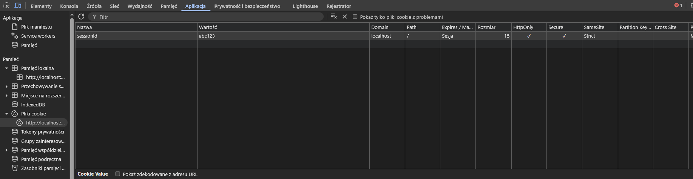

# Sprawozdanie - Secure Cookie Flag

## 1. Opis podatności

Brak ustawienia atrybutów bezpieczeństwa dla ciasteczek sesyjnych (np. `Secure`, `HttpOnly`, `SameSite`) może prowadzić do wycieku sesji, przesyłania ciasteczek po niezabezpieczonym kanale oraz zwiększa ryzyko CSRF. W zadaniu dostarczone są dwie implementacje:

- **Podatna** - [Vulnerable.java](Vulnerable.java)
- **Zabezpieczona** - [Secure.java](Secure.java) (ustawia `Secure; HttpOnly; SameSite=Strict`)

---

## 2. Struktura projektu:

```
Vulnerable.java
Secure.java
README.md
screenshots/
```

---

## 3. Krótkie omówienie implementacji

### 3.1 Podatna wersja (`Vulnerable.java`)

- Endpoint `/setcookie` ustawia nagłówek:
  ```
  Set-Cookie: sessionId=abc123
  ```
  Brak `Secure` i `HttpOnly` - cookie może być przesyłane po HTTP i odczytywane przez JavaScript (`document.cookie`).

### 3.2 Zabezpieczona wersja (`Secure.java`)

- Endpoint `/setcookie` ustawia nagłówek:
  ```
  Set-Cookie: sessionId=abc123; Secure; HttpOnly; SameSite=Strict
  ```
  `Secure` wymusza wysyłanie cookie tylko przez HTTPS (przeglądarka), `HttpOnly` uniemożliwia odczyt przez JS, `SameSite=Strict` ogranicza wysyłanie cookie w żądaniach cross-site.

---

## 4. Instrukcja uruchomienia i testów

1. Skompiluj:

```powershell
javac Vulnerable.java Secure.java
```

2. Uruchom:

```powershell
java Vulnerable   # uruchamia serwer na http://localhost:8100/setcookie
java Secure       # uruchamia serwer na http://localhost:8101/setcookie
```

Serwery:

- vulnerable: `http://localhost:8100/setcookie`
- secure: `http://localhost:8101/setcookie`

Przykładowe testy (PowerShell):

```powershell
# Vulnerable - curl
curl.exe -i "http://localhost:8100/setcookie"

# Secure - curl
curl.exe -i "http://localhost:8101/setcookie"
```

---

## 5. Wyniki testów

Do sprawozdania dołączono screenshoty:

- `compile.png` - kompilacja `javac Vulnerable.java Secure.java`
  
- `vulnerable_running.png` - uruchomiony serwer vulnerable
  
- `vulnerable_curl.png` - `curl -i` pokazujące `Set-Cookie: sessionId=abc123`
  
  - Output Vulnerable:

```
HTTP/1.1 200 OK
Set-Cookie: sessionId=abc123
```

- `secure_running.png` - uruchomiony serwer secure
  
- `secure_curl.png` - `curl -i` pokazujące `Set-Cookie: sessionId=abc123; Secure; HttpOnly; SameSite=Strict`
  
  - Output Secure:

```
HTTP/1.1 200 OK
Set-Cookie: sessionId=abc123; Secure; HttpOnly; SameSite=Strict
```

- `devtools_cookie_before.png` - DevTools: cookie bez flag
  
- `devtools_cookie_after.png` - DevTools: cookie z HttpOnly/Secure/SameSite
  

---

## 6. Wnioski

- Brak atrybutów `Secure` i `HttpOnly` naraża aplikację na kradzież sesji (np. przez XSS) oraz przesyłanie ciasteczek przez niezabezpieczone połączenia.
- Zalecane ustawienia dla sesji: `Secure; HttpOnly; SameSite=Strict` oraz używanie HTTPS w środowisku produkcyjnym.
